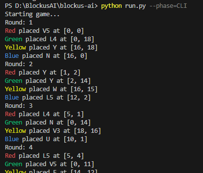
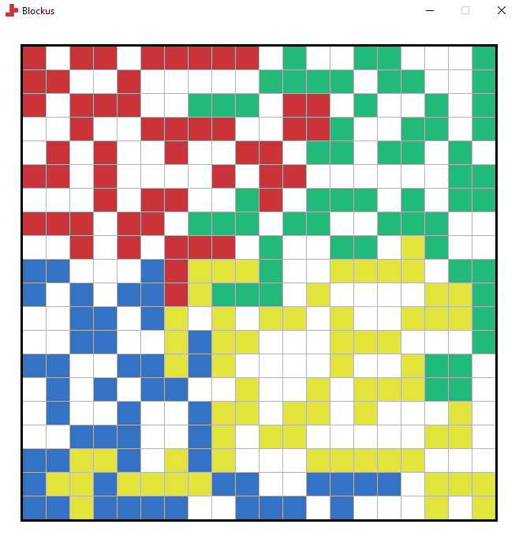

# Blokus, Brains, and Beating My Family (at Board Games... with AI)🕹️🤖
*By [Dan Champion](https://danchampion.dev), Apr 2025*


## Introduction:

### *What is Blokus?*

[Blokus](https://en.wikipedia.org/wiki/Blokus) is this wonderfully chaotic board game where the goal is to fit as many weirdly shaped pieces onto a board as possible — kind of like competitive Tetris, but with corners only. The game came out in 2000 and quickly became a favorite for families, strategy nerds, and anyone who enjoys passive-aggressively blocking their friends into a corner. Each player has their own colour, and your pieces can’t touch edge-to-edge, only corner-to-corner. It’s simple... right?

### *Wait, what are the rules?*

You can find the official rules [here](https://service.mattel.com/instruction_sheets/BJV44-Eng.pdf) from Mattel. To sum up, Blokus is all about *"trying to fit as many of your squares on the board as you can"* — while doing your best to block everyone else out.

Here’s a breakdown of the key rules:

1. Each player has their own colour — up to 4 players in total (Red, Blue, Green & Yellow).
2. You must **start in your corner** of the board and build out from there.
3. Your pieces can only touch **at the corners** — never edge-to-edge with your own pieces.
4. You can still touch other players’ pieces edge-to-edge.
5. The goal is to place as many of your pieces as possible before the board gets too crowded.
6. Once you run out of valid moves, **you’re out** — the squares of the remaining pieces counted is your final score.
7. **Lowest score** in the end is the winner!

Note: There are 2 and 3 player variations of Blockus, but in this case I will just stick to the classic 4-player rules since that’s what I usually play.

### *So... why am I making this?*

Blokus has been a thing in my family for years. We play it *a lot*. So much so that we’ve each got our own board — which sounds cute until someone rage-quits and storms off because they got ganged up on.

I’ve always loved how the game feels simple but has tons of interesting strategic layers hiding underneath. And since I’m also a huge nerd for AI and machine learning, I thought: *why not combine the two?* 🧠

After watching some Youtube coding legends like [Code Bullet](https://www.youtube.com/@CodeBullet), [b2Studios](https://www.youtube.com/@b2studios), and [Sebastian Lague](https://www.youtube.com/@SebastianLague), I got inspired to build my own AIs to take on Blokus which sadly doesn’t have a tremendous amount of AI research or bots built for it... yet.

Plus, let’s be real: if an AI I built can beat my family, that basically counts as *me* winning, right?

---

## Methodology:

I didn’t set out to build a genius — just a bot that could survive family game night. The plan? Break Blokus down into simple rules, teach the AI where it’s allowed to place stuff, and then make it play until it either got good… or gave up. I decided on Python to do this implementation, mostly because it’s easy, quick and its AI libraries are well-documented and supported (definitely not because I’m lazy to learn anything else)...👀

### Step 1: Developing the Game

Before diving into any kind of AI or simulation, the first step was to implement the game of Blokus itself. This meant recreating all the rules, board setup, and valid interactions programmatically.

I started by designing how the game state would be represented. The board was stored as a grid (a 2D array), and each player had a collection of unique pieces, each with different shapes. The key was making it easy to check if a piece could legally be placed somewhere on the board, and if so, how. I also needed to track the players’ turns, their remaining pieces, and the current state of the board. 

Three different implementations were created for this:
1. CLI - A simple text-based interface to play the game. This was a good way to test the game logic and rules without worrying about graphics or user experience.<br>
2. Basic GUI - A more user-friendly interface to visualize the game. This was built using Pygame.<br>
3. Advanced GUI - A more polished version of the GUI, with better graphics and user experience. This was also built using Pygame but the main feature is that you can play against the AI. How exiting!<br>

Next is how the game is structured. The game is split into three main classes: `Manager`, `Player`, and `Piece`. The `Manager` class handles the game logic, including player turns, piece placement, and scoring. The `Player` class represents each player, including their pieces and AI version. The `Piece` class represents the individual pieces that players can place on the board.

**Game Manager:**
```python
class Manager:
    def __init__(self, ai_versions, available_pieces_types = None, shuffle = False):
        self.intialise(available_pieces_types, ai_versions, shuffle)
        
    def intialise(self, available_pieces_types, ai_versions, shuffle):
        # Initialise Game
        self.round = 0
        self.turn = 0
        
        # Players
        self.no_of_players = 4

        # Validate AI versions
        self.ai_versions = ai_versions
        if len(self.ai_versions) != self.no_of_players:
            raise ValueError(f"Expected {self.no_of_players} AI versions, but got {len(self.ai_versions)}.")
        if any(ai_version == "hm" for ai_version in self.ai_versions):
            raise ValueError("Invalid AI version: 'hm' is only allowed for GAME phase.")
        
        self.player_list = [Player(player, self.ai_versions[player-1]) for player in range(1,self.no_of_players+1)]
        
        if shuffle:
            shift = random.randint(1, self.no_of_players)
            self.player_list = self.player_list[shift:] + self.player_list[:shift]

        # Generate Board
        self.board_size = 20
        self.board = [[ 0 for x in range(0,self.board_size)] for y in range(0,self.board_size)]

        # Generate Pieces for players
        self.available_pieces_types = available_pieces_types
        self.player_pieces = []
        for player in self.player_list:
            player.remaining_pieces = [Piece(piece_type,player.colour) for piece_type in available_pieces_types]

        self.start_time = time.time()


    def start_game(self):
        print(f"Starting game...")
        flag = True
        # Game Loop
        while(flag):
            self.round += 1
            self.output_text(f"Round: {self.round}")
            flag = False
            for player in self.player_list:
                if self.player_turn(player):
                    flag = True
            if STEP_BY_STEP: 
                draw._board(self.board)
                input("")
        self.end_game()

    def end_game(self):
        runtime = format(time.time()-self.start_time,".2f")
        print("Showing results...")
        print(f"Game finished after {runtime}s")
        print(f"Played a total of {self.round} rounds")

        if DRAW_RESULTS:
            # Show final state of board
            draw._board(self.board)
            # Show Remaining Pieces
            self.output_text("\nRemaining Pieces:")
            for player in self.player_list:
                pieces_list = [_.piece for _ in player.remaining_pieces]
                draw._pieces_in_row(pieces_list)

        # Show Results
        results = self.get_results()
        draw._results(results)
        

    def player_turn(self, player):
        player_string = draw.render_cell(player.colour, str(player))
        self.turn += 1

        # If player finished -> End Turn
        if player.finished:
            self.output_text(f"{player_string} is finished...")
            return False

        # If no pieces left -> End Turn
        available_pieces = player.remaining_pieces
        if len(available_pieces) == 0:
            player.finished = True
            self.output_text(f"{player_string} has no more pieces...")
            return False
        
        if DRAW: 
            print(f"{player_string}'s available pieces:")
            draw._pieces_in_row([_.piece for _ in available_pieces])

        if self.round == 1:
            # Get starting squares
            legal_corners = logic.get_starting_corner(self.board_size, player.colour)
        else:
            # If no corners to place piece -> End Turn
            legal_corners = logic.find_legal_corners(self.board, player.colour)
            if len(legal_corners) == 0:
                player.finished = True
                self.output_text(f"{player_string} has no legal moves...")
                return False
        
        # Get all possible moves
        legal_moves = logic.find_legal_moves(self.board, legal_corners, available_pieces, player.colour)
        # If no legal moves -> End Turn
        if len(legal_moves) == 0: 
            player.finished = True
            self.output_text(f"{player_string} has no legal moves...")
            return False
        
        # Get Move -> move = [orientation, cell, piece]
        final_move = player.generate_move(legal_moves, self.board, self.round)
       
        self.output_text(f"{player_string} placed {final_move[2]} at {final_move[1]}")
        if DRAW:
            draw._piece(final_move[0])

        # Remove piece from available pieces
        player.remaining_pieces.remove(final_move[2])

        # Place piece
        self.board = logic.place_piece(self.board, player.colour, final_move)

        # End Turn
        return True
    
    def output_text(self, text):
        if VERBOSITY: print(text)

    def get_results(self):
        return logic.calc_results(self.player_list)
```
**Player:**
```python
class Player:
    def __init__(self, colour, ai = "v1", name = None):
        self.colour = colour

        if name is None:
            match colour:
                case 1:
                    self.name = "Red"
                case 2:
                    self.name = "Green"
                case 3:
                    self.name = "Yellow"
                case 4:
                    self.name = "Blue"
                case _:
                    raise ValueError(colour, "is not a colour")
        
        self.ai = AI(ai)
        self.ai_version = ai
        self.finished = False
        self.remaining_pieces = []

    def __str__(self):
        return self.name

    def generate_move(self, legal_moves, board, round):
        return self.ai.generate_move(legal_moves, board, round)
    
    def current_score(self):
        return sum(piece.value for piece in self.remaining_pieces)
```
**Piece:**
```python
class Piece:
    def __init__(self, type, colour):
        self.type = type
        self.colour = colour
        piece, self.value = self.assign_piece(type)
        self.piece = transformations.set_colour(piece, colour)
        self.orientations = []

    def __str__(self):
        return f"{self.type}"

    def draw_piece(self):
        draw._piece(self.piece)

    def get_orientations(self):
        match self.type:
            case "I1" | "O4" | "X":
                return [self.piece]
            case "I2" | "I3" | "I4" | "I5":
                return [self.piece, 
                        transformations.rotate_piece_clockwise(self.piece, 1)]
            case "V3" | "T4" | "U" | "W" | "T" | "V5":
                return [self.piece, 
                        transformations.rotate_piece_clockwise(self.piece, 1),
                        transformations.rotate_piece_clockwise(self.piece, 2),
                        transformations.rotate_piece_clockwise(self.piece, 3)]
            case "Z4" | "Z5":
                return [self.piece, 
                        transformations.rotate_piece_clockwise(self.piece, 1),
                        transformations.flip_piece_vertical(self.piece),
                        transformations.flip_piece_vertical(transformations.rotate_piece_clockwise(self.piece, 1))]
            case "L4" | "Y" | "L5" | "N" | "F" | "P":
                return [self.piece, 
                        transformations.rotate_piece_clockwise(self.piece, 1),
                        transformations.rotate_piece_clockwise(self.piece, 2),
                        transformations.rotate_piece_clockwise(self.piece, 3),
                        transformations.flip_piece_vertical(self.piece),
                        transformations.flip_piece_vertical(transformations.rotate_piece_clockwise(self.piece, 1)),
                        transformations.flip_piece_vertical(transformations.rotate_piece_clockwise(self.piece, 2)),
                        transformations.flip_piece_vertical(transformations.rotate_piece_clockwise(self.piece, 3))]
            case _:
                raise ValueError(self.type,"is not a piece")

    def assign_piece(self, type):
        match type:
            case "I1":
                return piece_i1,1
            case "I2":
                return piece_i2,2
            case "I3":
                return piece_i3,3
            ...
            case _:
                raise ValueError(type,"is not a piece")


# Basic Pieces
piece_i1 = [[1]]
piece_i2 = [[1,1]]
piece_i3 = [[1,1,1]]
...
```

Now the last step is just to implement the game logic and rules. This includes checking for legal moves, placing pieces, and calculating scores. I created a `logic` module to handle all the game rules and interactions.

**Logic:**
```python
def is_cell_within_bounds(board, cell): # cell = [row,col]
    rows = cols = len(board)
    if 0 <= cell[0] < rows and 0 <= cell[1] < cols:
        return True
    return False

def is_cell_free(board, cell): # cell = [row,col]
    if is_cell_within_bounds(board, cell):
        if get_cell_colour(board, cell) == 0:
            return True
    return False

def is_cell_adjacent_to_colour(board, cell, colour): # cell = [row,col]
    adj_cells = [
                    [cell[0] - 1,cell[1]],  # Top
                    [cell[0] + 1, cell[1]],  # Bottom
                    [cell[0], cell[1] - 1],  # Left
                    [cell[0], cell[1] + 1]   # Right
                ]
    for adj_cell in adj_cells:
        if is_cell_within_bounds(board, adj_cell):
            if get_cell_colour(board, adj_cell) == colour:
                return True
    return False

def get_cell_colour(board, cell):
    return board[cell[0]][cell[1]]

def find_legal_corners(board, colour):
    board_size = len(board)
    legal_corners = []        
    for row in range(board_size):
            for col in range(board_size):
                if board[row][col] == colour:
                    # Look at corners
                    corners = [
                        [row - 1, col - 1],  # Top-left
                        [row - 1, col + 1],  # Top-right
                        [row + 1, col - 1],  # Bottom-left
                        [row + 1, col + 1]   # Bottom-right
                    ]
                    for corner in corners:
                        # If cell is:
                        #  Not within the board
                        #  Occupied
                        #  Adjacent to same colour
                        if (is_cell_within_bounds(board, corner) and
                            is_cell_free(board, corner) and
                            not is_cell_adjacent_to_colour(board, corner, colour)):
                            legal_corners.append(corner)               
    
    return legal_corners

def find_legal_moves(board, legal_corners, available_pieces, colour):
    legal_moves = []
    for corner in legal_corners:
        for piece in available_pieces:
            orientations = piece.get_orientations()
            for orientation in orientations:
                for row_offset in range(len(orientation)):
                    for col_offset in range(len(orientation[row_offset])):
                        if orientation[row_offset][col_offset]:  # Check if this cell of the piece is occupied
                            cell = [corner[0] - row_offset, corner[1] - col_offset]
                            move = [orientation, cell, piece]
                            if is_move_legal(board, move, colour, legal_corners):
                                legal_moves.append(move)
    return legal_moves

def is_move_legal(board, move, colour, legal_corners):
    # Check if the piece has at least one tile on a legal corner
    piece = move[0]
    cell = move[1]
    legal = False

    for row in range(len(piece)):
        for col in range(len(piece[row])):
            if piece[row][col]:  # Check if this cell of the piece is occupied
                current_cell = [cell[0] + row, cell[1] + col]

                # Check if the cell is within bounds and free
                if not is_cell_within_bounds(board, current_cell) or not is_cell_free(board, current_cell):
                    return False

                # Check if the cell is adjacent to the same colour
                if is_cell_adjacent_to_colour(board, current_cell, colour):
                    return False

                # Check if the piece has at least one tile on a legal corner
                if current_cell in legal_corners:
                    legal = True

    return legal

def place_piece(board, colour, move):
    piece = move[0]
    cell = move[1]
    for row in range(len(piece)):
        for col in range(len(piece[row])):
            if piece[row][col]:
                board[row+cell[0]][col + cell[1]] = colour
    return board

def get_starting_corner(board_size, colour):
    match colour:
        case 1: # Red starts in top-left
            return [[0,0]]
        case 2: # Green starts in top-right
            return [[0,board_size-1]]
        case 3: # Yellow starts in bottom-right
            return [[board_size-1,board_size-1]]
        case 4: # Blue starts in bottom-left
            return [[board_size-1,0]]
        case _:
            raise ValueError("Invalid Colour")

def calc_results(players_list):
    results = []
    for player in players_list:
        results.append([player.name, player.colour, player.current_score(), player.ai_version, player.remaining_pieces])
    return results

```

### Step 2: Creating the AI(s)
With the rules in place and legal moves detected, it was finally time to create an AI that could play.

The core of the AI takes in the current state of the board, the player’s remaining pieces, and their turn. Based on this information, it selects a move from the list of valid ones.

To begin with, I kept the AI simple — just picking random legal moves. This gave me a baseline to compare against.

**Random AI**: This AI picks a random legal move from the list of available moves. It’s not very smart, but it’s a good starting point to see how the game works.

`v1_random.py`:
```python
import random

#Pick random move
def generate_move(legal_moves, board, round):
    return legal_moves[random.randint(0,len(legal_moves)-1)]
```

This was a good start, but I wanted to make the AI smarter. So I added a few more versions with different strategies.

**Greedy AI**: This AI ranks the legal moves based on the value of the piece being placed down. It always picks the highest value piece first, which is a pretty good strategy for winning.

`v2_greedy.py`:
```python
import random

# Pick move with highest value
def generate_move(legal_moves, board, round):
    highest_value_moves = [legal_moves[0]]
    max_value = highest_value_moves[0][2].value

    for move in legal_moves:
        if move[2].value == max_value:
            highest_value_moves.append(move)
        elif move[2].value > max_value:
            max_value = move[2].value
            highest_value_moves = [move]

    return highest_value_moves[random.randint(0,len(highest_value_moves)-1)]
```

**Evaluator AI**: This AI uses a simple evaluation function to score each legal move based on a few heuristics that come from my experience playing and tips collected from the internet. It will then pick the move with the highest score. 

Here are some tips to win Blockus that this AI considers, gathered from various sources and my own experience:
1. Use larger pieces at the beginning:
    - When given an option pick the largest piece and this reduces your score the most and smaller pieces are easier to place down later on than larger ones.
2. Control the centre ground:
    - For the first few rounds, it is important to move towards the center, since that allows for more options later on. Big advantage if you go first too!
3. Create more options for yourself:
    - When placing a piece down, see if it provides more or less corners than before.
4. Shut down opportunities for your opponents:
    - When placing a piece down, see if we a blocking any of their potential moves. In Blockus, you can usually see the remaining pieces of your opponents, so you can predict their next move and try to block them.
5. Think about when best to use the single square (or other small pieces):
    - Typically only as a last resort. It can also be used to free yourself in a tight situation/area, so it should be saved smartly.
6. Leave *free placements* for later:
    - A *free placement* is essentially a move that you can place that no one else can prevent in the next few moves or ever. So why would you waste an opportunity/piece there?

`v3_evaluator.py`:
```python
import math
import copy
from ..helpers import logic

# Heuristic parameters based on limited testing
CENTER_WEIGHT = 5.0
EXPANSION_WEIGHT = 4.0
BLOCK_OPPONENT_WEIGHT = 6.0
PIECE_VALUE_WEIGHT = 3.0

# Pick move with highest score based on evaluation function
def generate_move(legal_moves, board, game_round):
    simulated_board = copy.deepcopy(board)
    best_move = legal_moves[0]
    highest_score = evaluate_move(best_move, simulated_board, game_round)

    for move in legal_moves[1:]:
        current_score = evaluate_move(move, simulated_board, game_round)
        if current_score > highest_score:
            best_move = move
            highest_score = current_score

    return best_move

# Evaluates a move using a heuristic scoring system.
def evaluate_move(move, simulated_board, game_round):
    board_size = len(simulated_board)
    score = 0

    # Score based on proximity to the center
    score += CENTER_WEIGHT * calculate_center_proximity(move[1], board_size)

    # Simulate placing the piece on the board
    simulated_board = logic.place_piece(simulated_board, move[2].colour, move)

    # Score based on expansion potential
    new_legal_corners = logic.find_legal_corners(simulated_board, move[2].colour)
    score += EXPANSION_WEIGHT * len(new_legal_corners)

    # Penalize based on blocking opponent's moves
    opponent_colours = get_all_player_colours(simulated_board, exclude=move[2].colour)
    for colour in opponent_colours:
        score -= BLOCK_OPPONENT_WEIGHT * len(logic.find_legal_corners(simulated_board, colour))

    # Score based on piece value
    score += PIECE_VALUE_WEIGHT * calculate_piece_value(move[2], game_round)

    return score

# Calculates a score based on the proximity of a point to the center of the board.
def calculate_center_proximity(point, board_size):
    center = board_size / 2
    return 1 / (math.sqrt((center - point[0]) ** 2 + (center - point[1]) ** 2) + 1)

# Calculates a score based on the area of the piece and the game round.
def calculate_piece_value(piece, game_round):
    return piece.value * (1.5 if game_round <= 6 else 0.8)

# Retrieves all unique player colours present on the board, excluding a specific colour if provided.
def get_all_player_colours(board, exclude=None):
    return {cell for row in board for cell in row if cell and cell != exclude}

```

As you can see from the above implementation, that I’m missing a few of the strategies that were mentioned. This is because I wanted to keep the AI simple and also performant. Tips 5 & 6 are much harder to implement and require a lot more computation, since the AI needs to look ahead and predict moves from 3 other players. AIs used in Chess and 2-player games use this [Minimax](https://en.wikipedia.org/wiki/Minimax) approach where it *"minimises the worst case scenario"*, however have a 4-player game requires a lot of [pruning](https://en.wikipedia.org/wiki/Decision_tree_pruning) to enable this to be efficient. This is something I will look into later on, but for now let’s just keep it as this. 😅

*Edit: I during my research for this project, I found out that there are some AIs that use a [Monte Carlo Tree Search](https://en.wikipedia.org/wiki/Monte_Carlo_tree_search) approach to play Blokus called [Pentobi](https://pentobi.sourceforge.io/). This is AI uses book openings and Monte Carlo simulations to play the game. It is written in C++ which is much faster than Python, so I’m not sure how I will even compete with that...*

And now is the moment you’ve been waiting for... the Reinforcement Learning AI! This is most complex one of all, and guess what? This is the first time I’ve ever done anything like this. So, I’m not going to pretend I know what I’m doing here. But here’s the gist of it:

*What is required for Reinforcement Learning?*
- A reward function: This is a function that tells the AI how well it’s doing. In this case, I used the score of the player as the reward. The AI gets a positive reward for placing pieces and a negative reward for running out of pieces.
- A way to explore the environment: The AI needs to be able to try different moves and see what happens. I used a simple epsilon-greedy strategy, where the AI picks a random move with a small probability (epsilon) and otherwise picks the best move based on its current knowledge.
- A way to learn from experience: The AI needs to be able to update its knowledge based on the rewards it receives. I used a simple Q-learning algorithm, where the AI updates its Q-values based on the rewards it receives and the best Q-value of the next state.


### Step 3: Testing the AIs (on the battlefield ⚔️)


Repeat:
Create AI, which takes state of board, remaining pieces, and whose turn it is
After each AI, it will play against itself (play against 3 other random movements), play 400 games? (100 as each colour) see how many they win and by how much


---

## Results & Conclusion

After this point, we need to consider how the AI performs against the best version we have
As we want to look into the best move that the opponent could make and try to prevent that 

AI that leave free placements for later
- A free placement = a move which can’t be done by anyone else
- To do this we must know the possible moves, and remaining pieces of our opponents

AI that watches your opponents’ moves and their remaining pieces

THEN WORRY ABOUT: optimisations and thinking time
move should be made within a reasonable amount of time

Discuss final results
- also record the percentage increase in wins when who goes first


# Final Remarks
Technical Challenges
- Was python the best choice?

Limitations
COmpared to Chess or Connect 4, 
BLockus is a game designed for 2 or 4 players. 
when experiencing 4 players computations very heavy, cannot go indepth

Further Work
Develop general command line engine, which is general enough for potentially other bots to play??
Solve games which are about to end? Ensure victory when there are X amount of pieces left...
Reinforment/Deep learning strategies?
Search algorithms? look further ahead to moves opponent could make (2/3 rounds)

Goodbye for now, 
